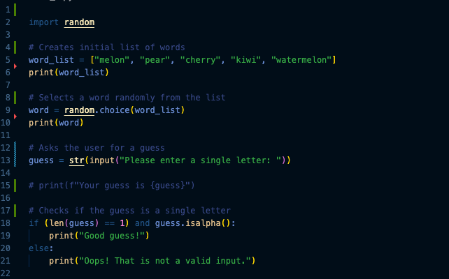

# Hangman
Hangman is a classic game in which a player thinks of a word and the other player tries to guess that word within a certain amount of attempts.

This is an implementation of the Hangman game, where the computer thinks of a word and the user tries to guess it. 

## Milestone 1

The implementation uses Python 3.9, a highly human-readable, high-level language that enables rapid prototyping.

In this milestone, the foundations for the Hangman were coded: 

1. A list of possible words is sorted
1. The built-in random module is used to choose a word randonly from the list
1. The user is asked for a single letter input which constitutes a guess at a letter in the word
1. The guess is checked to verify that it is a single-character, alphabetical string

## Milestone 3

As part of this milestone, the code to request that the user inputs a single character as a guess and validates it was moved to a function: ask_for_input
A second function, check_guess, was added to check whether the guessed character appears in the target word. It takes the user's guessed character and provides feedback to the user on whether the character is present in the word or not.

## Milestone 4

In the milestone, a class was defined to encapsualte the attributes and methods associated with an object that represents a game of Hangman.

Attributes:
- word_list: A list of potential words which must be passed as argument to the initialisation method
- num_lives: The number of lives a player has, which can be passed as an integer parameter when the object is initialised, and defaults to 5
- word: A target word selected at random from the word_list
- word_guessed: A representation of the target word which shows the current unguessed letters. Letters are filled in when a player enters a correct guess
- num_letters: The number of unique unguessed letters remaining 
- list_of_guesses: a list of letters guessed previously by the player

Methods:
- Initialiser: An object is created by passing a list of words and, optionally, a number of lives. It sets the attributes above.
- ask_for_input: Requests that the user enters a single character guess, validates the input and check that it is not already in the list of previous guesses. It loops to request further guesses if the guess does not meet the requirements. If the checks are passed, the guess is passed to the check_guess method. 
- check_guess: Checks whether the guessed letter is present in the target word. It updates the word_guessed and num_letters in the case of a correct guess. It reduces the number of lives if incorrect. The current guess is added to the list of guesses.
